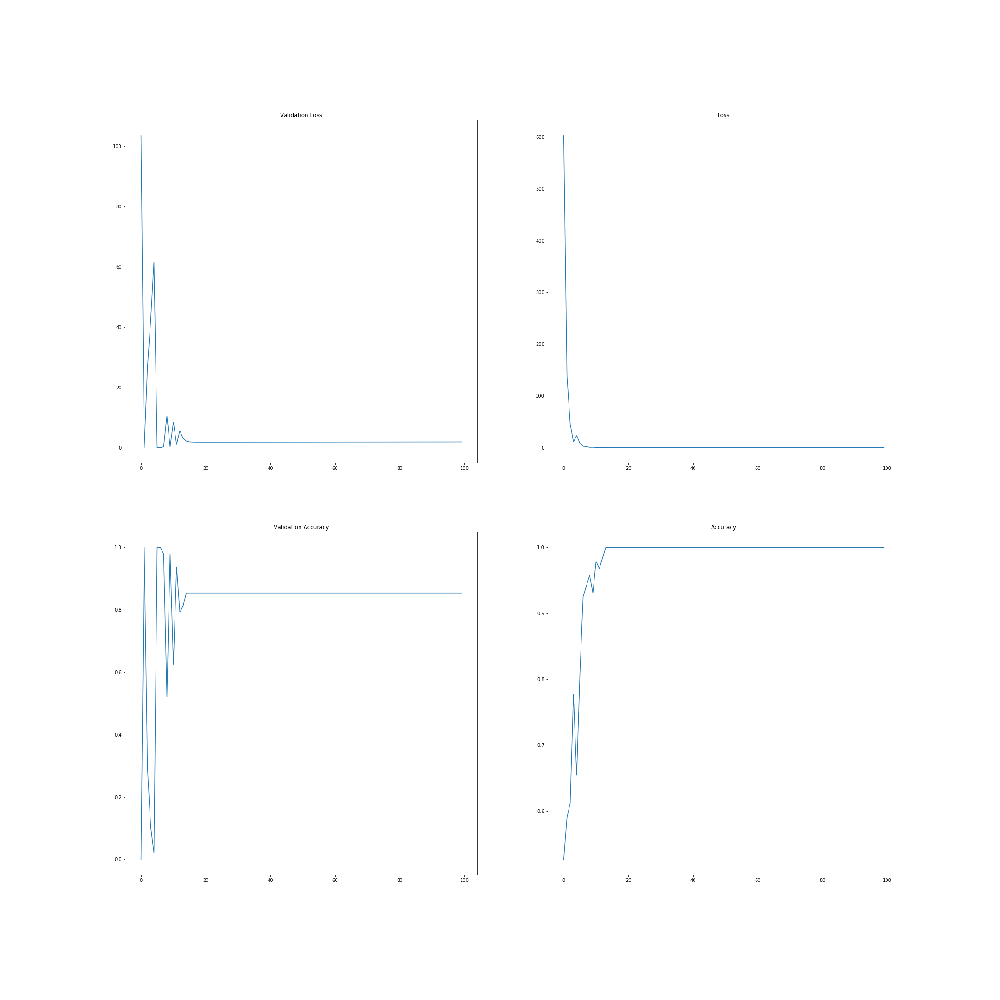

# covid19
Classification of whether the person is infected by COVID19 or not, based on 136 COVID19 XRay images, and 100 Normal XRay images.

---

Following is the result on 188 train images and 48 validation images

